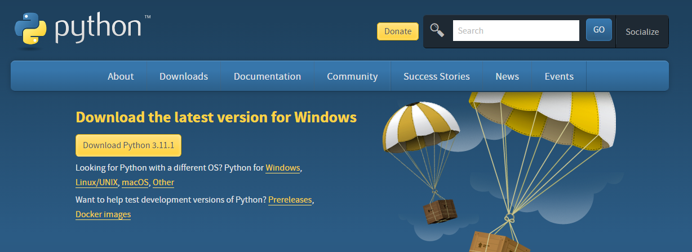
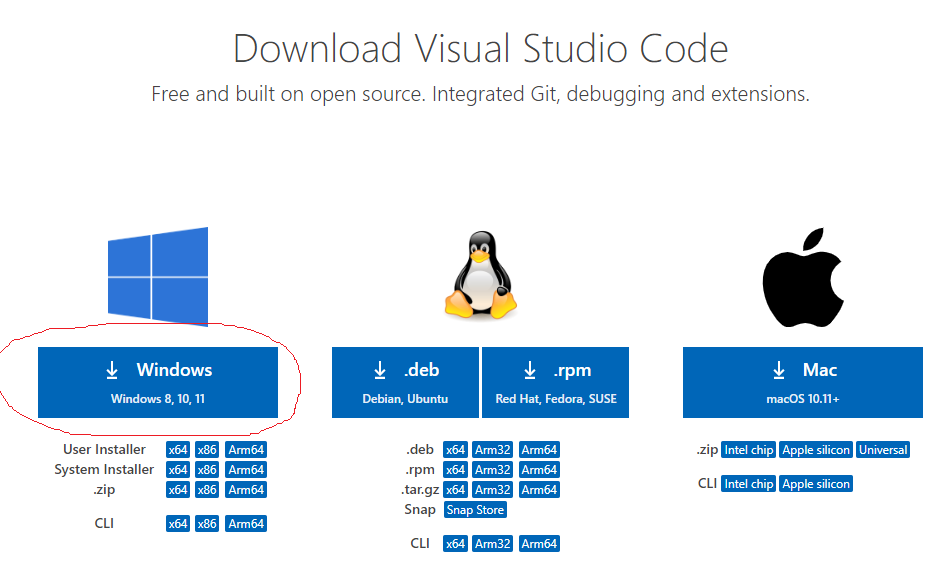
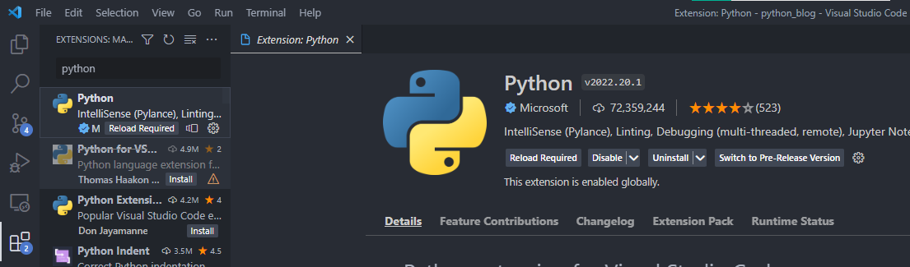
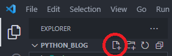

# Preparation Using Python
## Installing Python and Editor (VSCode)

1. Prepare the PC / Laptop, in this tutorial i use Windows 10 for installation process
2. Download [python installation](https://www.python.org/ "Python")
3. 
4. Then we download editor application for edit the python code.
5. Download [VSCode installation](https://code.visualstudio.com/download "VSCode")
6. 
7. Choose your operating system
8. Now, open the python installation at Download folder in your device
9. **Check** install laucher for all users (recommended), this is for python laucher in all users of the device
10. **Check** Add Python {Version} to PATH, this is for we can use python from command prompt or terminal
11. Click **Install Now**, wait until finish
12. Then, open the VSCode installation at Download folder in your device
13. **Check** Add "Open with Code" action in Windows Explorer file context menu, this is for add action when you right click a file that can open with VSCode
14. **Check** Add "Open with Code" action in Windows Explorer directory context menu, this is for add action when you right click a folder that can open with VSCode
15. **Check** Register Code as an editor for supported file types, this is for register VSCode to be default editor for supported file types
16. **Check** Add to PATH (required shell restart), this is useful when you use terminal or shell to open VSCode at current directory 
17. **Click Next**, wait until finish
18. `downloads> code .`
19. This will open VSCode at downloads directory

## Setup VSCode for python development
1. open VSCode, use terminal or open with icon in Dekstop if exist
2. Go to extension you can click the icon in left panel
3. 
4. Search for python
5. 
6. Install python extension, i have already install the extension so the install button not appear

## First Code
1. Open VSCode at desired directory using **terminal** **or** you can **right click** at the directory and choose "open with code"
2. `{desired directory}> code .` this will open at desired directory
3. 
4. Type name of file and give extension `.py`, ex: "file1.py"
5. Type in "file1.py" `print("Hello Python")`
6. Run the code with `Ctrl + F5`
